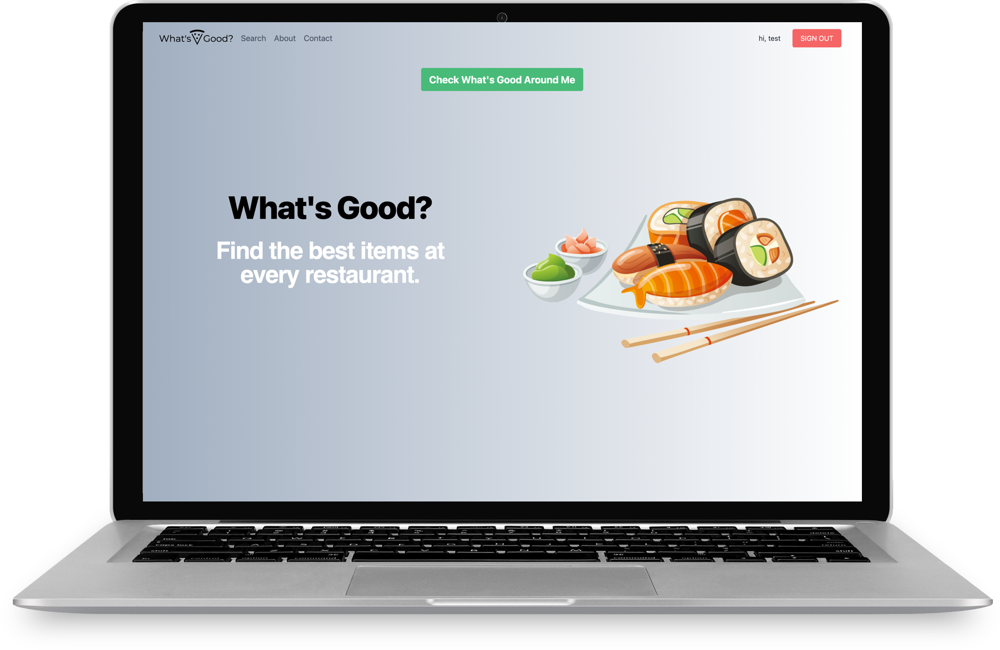

# Overview

What's Good is an application, built with React & MongoDB, that allows users to find the best dishes at every restraurant. 

- Live website: tbd
- Github: https://github.com/jlam3950/whats-good
- Team: Jeff L., Seth R. 

<!-- ## Features  -->

<!-- ## Navigating the App 

(<a href="#readme-top">back to top</a>)
 -->

## Technologies Used

* React
* MongoDB
* NodeJS
* Express
* Passport.js 
* Oauth
* Google Maps API 

<!-- ## Future Plans -->

